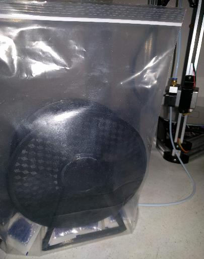

Print directly from filament stored in a ziplock bag.

Prevent dust and humidity from getting into your filament.  See the
[instructions](docs/Instructions.md) for details on printing and
assembling this filament spool holder.

