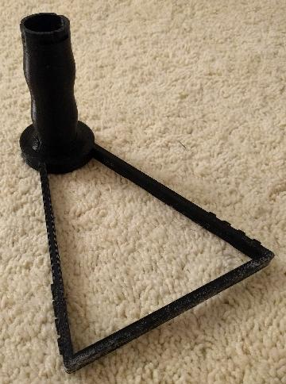
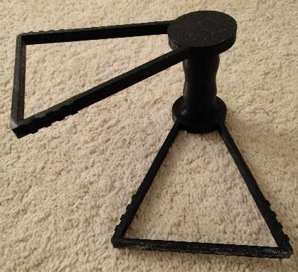
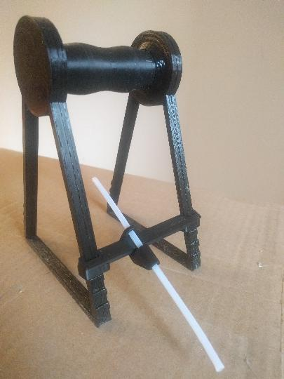
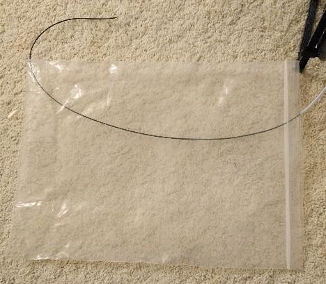

In order to use this spool holder you will need:

1. A ziplock bag. Regular 1Kg spools will fit in "2 gallon bags"
   (13x15inch / 33x38.1cm) that can be widely found in grocery stores.
   It's also possible to purchase thicker ziplock bags online, which
   do a better job at keeping out humidity. A regular 1Kg spool will
   fit in a 12x15inch (30.5x38.1cm) 6mil bag.

2. PTFE tubing (4mm outside diameter). At least 20cm (8 inches) of
   tubing is needed. It is recommended to have enough tubing to go
   from the spool holder to the extruder motor. It is recommended to
   use tubing with an inside diameter of 3mm (an inside diameter of
   2mm also works but has higher friction).

3. Desiccant (optional). A few packets of desiccant will help keep the
   filament dry. Look online to purchase desiccant packets that change
   color when they are saturated and that can be microwaved to reuse.

4. The printed parts from the [stl directory](../stl/). You will need
   two copies of the holder file (print the same holder object twice),
   one spindle, and one clip. If you have a small print bed that does
   not fit the default holder then you may print the holder-short file
   instead. If you are using a large filament spool (such as a "5lb
   spool") then use the holder, spindle-wide, and clip-wide files.

### Assembling the printed parts

It is a good idea to assemble the printed parts without the spool
first as the printed parts may initially be tight.

Align the channels on the spindle with the protrusions on the holder
and insert the spindle into one of the holders. Then turn the spindle
30 degrees to lock the spindle into place.

Align the spindle channels with the protrusions on the second holder
such that the two holders are about 60 degrees out of alignment. Push
the holder onto the spindle and then twist the holder so that both
holders align. Once you've completed twisting the two holders into
alignment it should not be possible to further twist the two holders
in that direction. At this point the two holders and spindle should be
locked into place.

Cut two lengths of ptfe tubing each approximately 10cm (4 inches)
long. After cutting the tubing inspect the opening on the tubing to
ensure it is still round. If the opening is not round, use a small
pliers to push the tubing back into a round shape.

Push each piece of ptfe tubing into each side of the clip. Attach the
clip to the two holders - it should click into place.

After completing the initial assembly and verifying that the pieces
fit together, it is time to assemble the pieces with the filament
spool. Keep the filament secure to the filament spool until you are
ready to feed the filament through the clip. Disassemble the spool
holder and then reassemble it with the spool on the spool holder.
Place the clip on the side of the spool holder so that the filament
will be pulled under the filament spool on its way to the printer.

Use a pair of scissors to cut 1mm from one bottom corner of a ziplock
bag. The hole should be just large enough for the filament to pass
through it. While the spool and spool holder are outside of the bag,
carefully pass the filament through the ptfe tubing and clip, through
the inside of the bag, and then through the hole in the corner of the
bag.

Then place the filament spool into the bag such that it is standing
within the bag (the seal should be at the top).

Add desiccant to the bag and then seal it. An additional length of
ptfe tubing can be used to go from the ptfe tubing on the clip all the
way to the printer's extruder motor.

